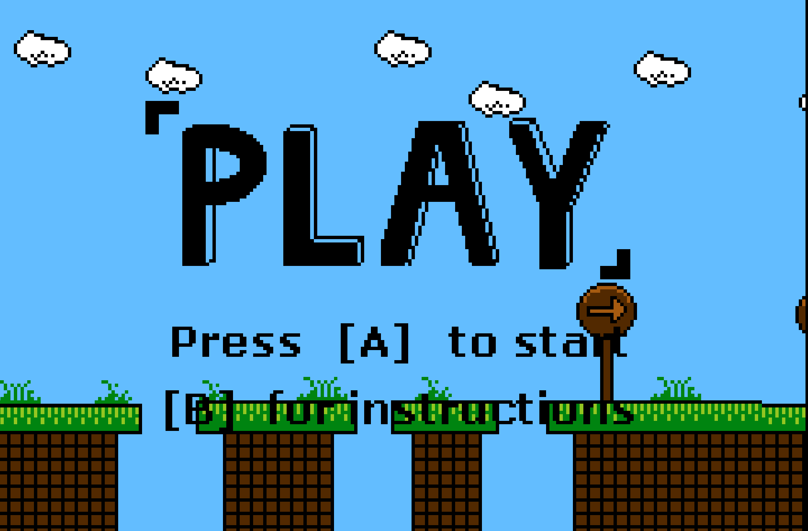
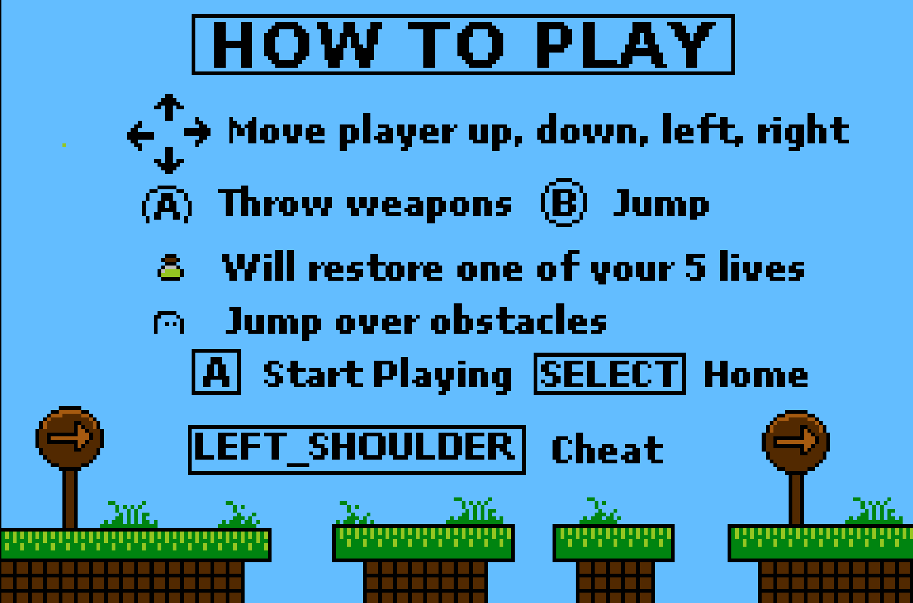
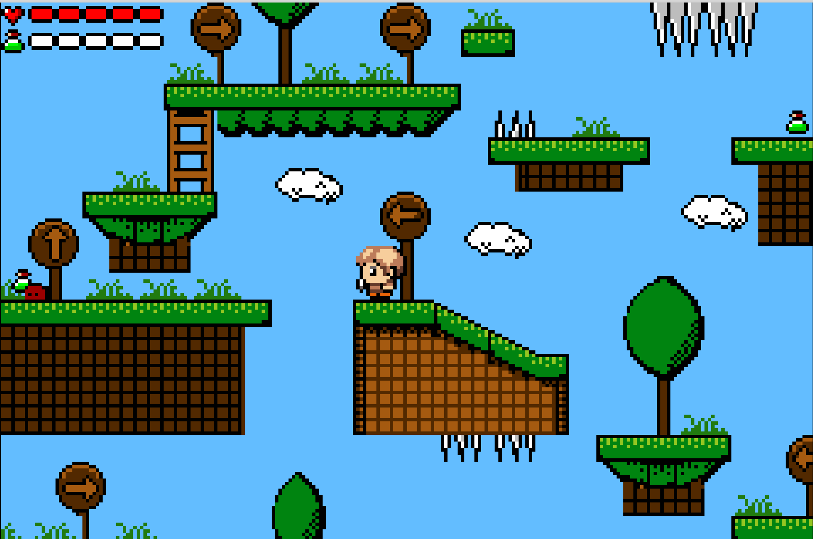
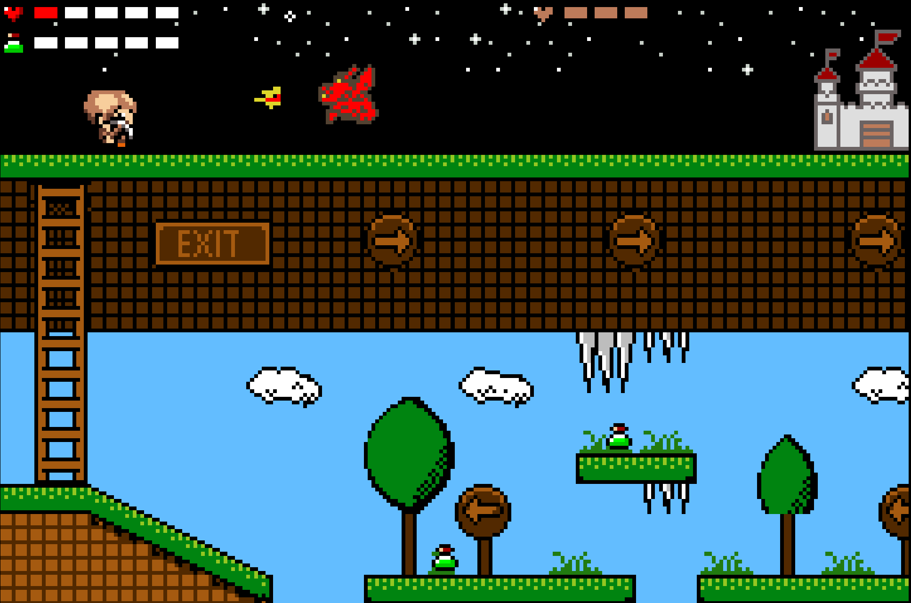
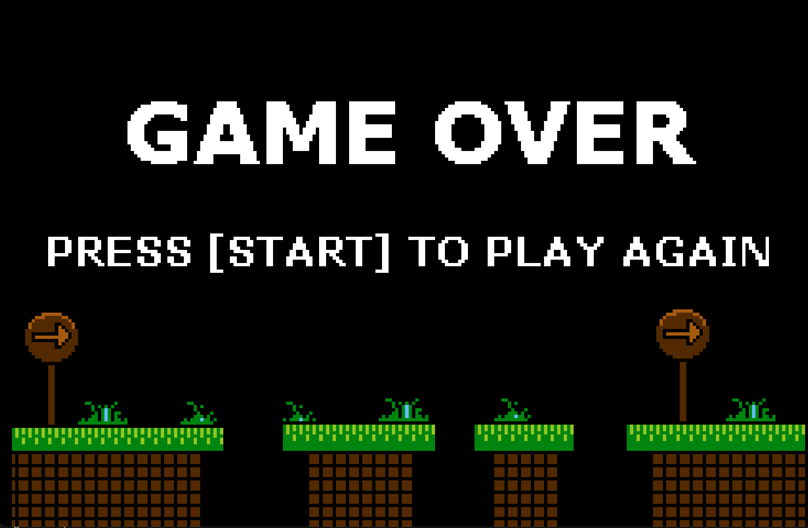

# Axe-pedition: Skybound

A Game Boy Advance action platformer built in C with tilemap collision, sprite-based combat, and audio playback.
Built as a course project focused on low-level graphics/sound and performance constraints.
Course: CS 2261 (Media Device Architecture), Fall 2023.

## Gameplay
Defeat the boss monster while navigating platforms, ladders, spikes, and enemies. Collect power-ups to regain health.

- Win: boss HP reaches 0
- Lose: player HP reaches 0

## Controls
- D-Pad: move / climb ladders
- B: jump
- A: throw axe (after pickup)
- START: pause / resume
- SELECT (from pause): back to start
- L: cheat toggle (dev/debug)

## Tech Highlights
- Tilemap collision using a bitmap collision map (collisionmap2)
- State machine for Start -> Instruction -> Game -> Pause -> Win/Lose
- Sprite system with OAM updates and animation timing
- DMA transfers for backgrounds, sprites, and palette loads
- Audio playback with interrupts and looping BGM

## Build & Run
Requirements: devkitPro (devkitARM), mGBA or VisualBoyAdvance

```bash
make
# outputs Project.gba
```

Open `Project.gba` in an emulator.

## Implementation Notes
- Camera scroll centered on the player with map bounds
- Boss attack patterns and projectile logic
- Health/energy UI rendered via sprite tiles

## Lessons Learned
- Optimizing frame updates under 60 FPS constraints
- Managing GBA memory/VRAM layout and DMA timing
- Designing game states cleanly for low-level hardware

## Credits
- Sprites: based on assets from OpenGameArt; all sprites were heavily edited/kitbashed by me.
- Other art/audio: created or edited by me for this project.

## Gameplay Screenshots

### Start Screen


### Instruction Screen


### Gameplay



### Game Over

